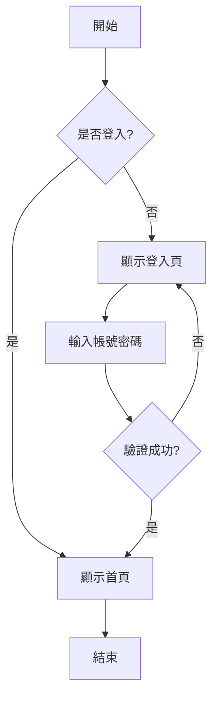
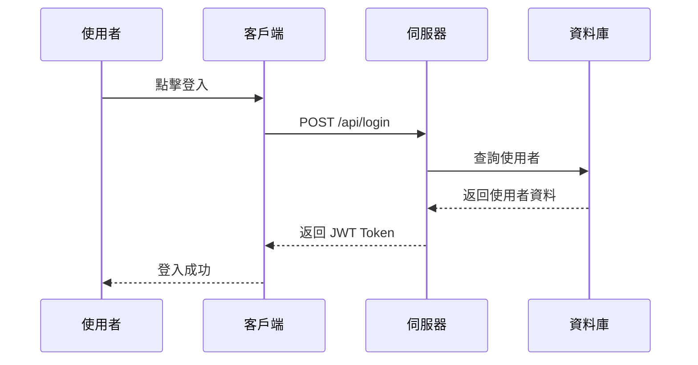
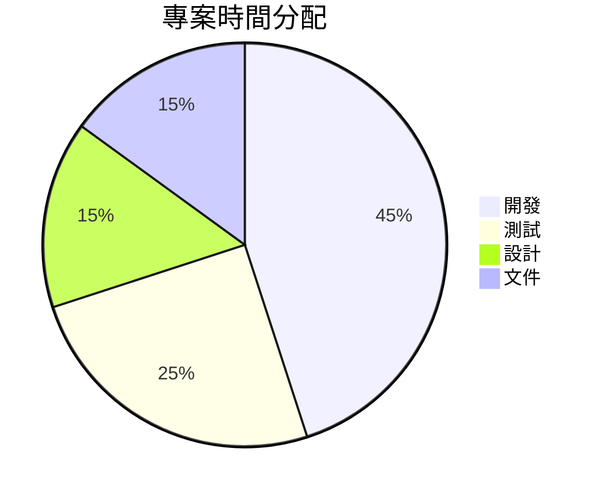

# Markdown Editor 測試文件

這是一個完整的 Markdown 語法測試文件，包含新增功能的示範。

---

## 文字格式

這是普通文字。**這是粗體文字**。*這是斜體文字*。***這是粗斜體文字***。

這是一段包含 `行內程式碼` 的文字。

~~這是刪除線文字~~

---

## 標題層級

### 三級標題
#### 四級標題
##### 五級標題
###### 六級標題

---

## 清單

### 無序清單
- 第一項
- 第二項
  - 巢狀項目 A
  - 巢狀項目 B
    - 更深層的巢狀
- 第三項

### 有序清單
1. 第一步
2. 第二步
3. 第三步
   1. 子步驟 A
   2. 子步驟 B

### 任務清單
- [x] 已完成的任務
- [x] 另一個完成的任務
- [ ] 待辦事項
- [ ] 另一個待辦事項

---

## 引用區塊

> 這是一段引用文字。
> 
> 引用可以包含多個段落。

> **提示**：引用區塊也可以包含其他格式，例如 `程式碼` 或 **粗體**。

---

## 程式碼區塊

### JavaScript
```javascript
// 這是 JavaScript 程式碼
function greet(name) {
    console.log(`Hello, ${name}!`);
    return {
        message: 'Welcome to Markdown Editor',
        timestamp: new Date().toISOString()
    };
}

const result = greet('World');
```

### Python
```python
# 這是 Python 程式碼
def fibonacci(n):
    """Generate Fibonacci sequence"""
    a, b = 0, 1
    for _ in range(n):
        yield a
        a, b = b, a + b

# 輸出前 10 個費氏數列
for num in fibonacci(10):
    print(num, end=' ')
```

### CSS
```css
/* 暗色主題範例 */
:root {
    --bg-primary: #0d1117;
    --text-primary: #e6edf3;
    --accent-blue: #58a6ff;
}

.card {
    background: var(--bg-primary);
    color: var(--text-primary);
    border-radius: 12px;
    padding: 1.5rem;
    box-shadow: 0 4px 12px rgba(0, 0, 0, 0.4);
}
```

---

## 表格

| 功能 | 狀態 | 說明 |
|------|:----:|------|
| 拖曳上傳 | ✅ | 支援 .md 和 .markdown 檔案 |
| 暗色主題 | ✅ | GitHub Dark 風格 |
| 程式碼高亮 | ✅ | 使用 highlight.js |
| 響應式設計 | ✅ | 支援手機和平板 |
| 表格支援 | ✅ | 包含對齊功能 |

---

## 連結與圖片

### 連結
- [GitHub](https://github.com)
- [marked.js 文件](https://marked.js.org/)
- [highlight.js](https://highlightjs.org/)

### 圖片
這裡可以放置圖片（需提供有效的圖片 URL）：


---

## 數學公式 (KaTeX)

### 行內公式
質能等價公式：$E = mc^2$

二次方程的解：$x = \frac{-b \pm \sqrt{b^2 - 4ac}}{2a}$

### 區塊公式

$$
\sum_{i=1}^{n} x_i = x_1 + x_2 + \cdots + x_n
$$

$$
\int_{-\infty}^{\infty} e^{-x^2} dx = \sqrt{\pi}
$$

$$
\begin{pmatrix}
a & b \\
c & d
\end{pmatrix}
\begin{pmatrix}
x \\
y
\end{pmatrix}
=
\begin{pmatrix}
ax + by \\
cx + dy
\end{pmatrix}
$$

---

## Mermaid 圖表

### 流程圖


### 時序圖


### 圓餅圖


---

## 新增功能測試

### 快捷鍵
- `Ctrl + N` - 新建檔案
- `Ctrl + O` - 開啟檔案
- `Ctrl + S` - 存檔
- `Ctrl + F` - 搜尋與取代
- `Ctrl + Z` - 復原
- `Ctrl + Y` - 重做
- `Ctrl + B` - 粗體
- `Ctrl + I` - 斜體
- `Ctrl + K` - 插入連結
- `Ctrl + E` - 切換編輯/預覽模式
- `Ctrl + P` - 列印
- `Escape` - 關閉對話框或切換到預覽模式

### 功能清單
- ✅ Undo/Redo 歷史記錄
- ✅ 搜尋與取代
- ✅ 編輯器工具列
- ✅ 數學公式支援 (KaTeX)
- ✅ Mermaid 圖表支援
- ✅ 圖片拖曳/貼上
- ✅ 字數統計
- ✅ 目錄導航
- ✅ 主題切換
- ✅ 列印友好模式
- ✅ PDF 導出
- ✅ 存檔路徑選擇
- ✅ 編輯模式加寬

---

## 結語

🎉 恭喜！如果你能看到這個頁面正確渲染，表示 Markdown Editor 運作正常！

---

*Made with ❤️ using marked.js, highlight.js, KaTeX & Mermaid*
